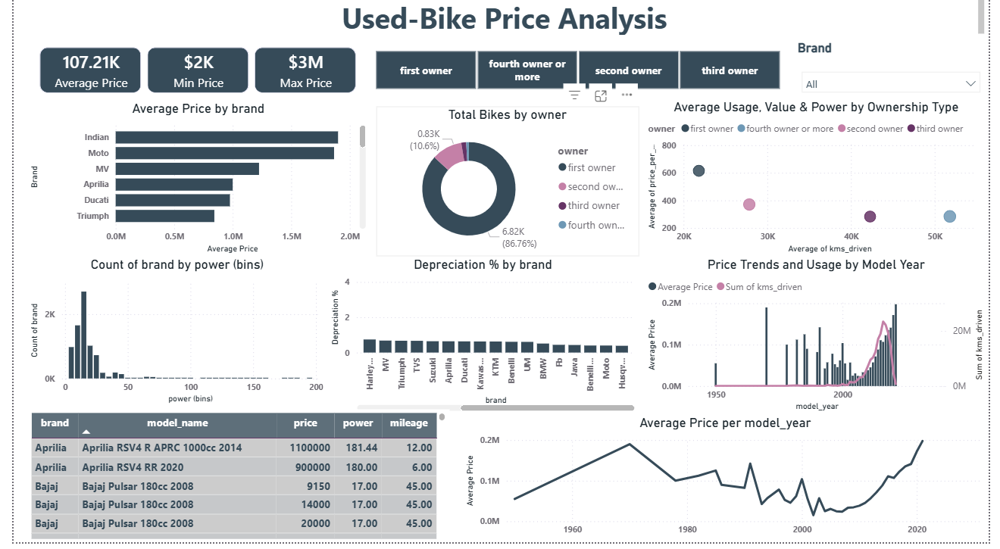

# 🚀 Used Bike Price Analysis & Price Prediction

## 📌 Executive Summary

This project performs an end-to-end data analysis and predictive modeling workflow on a used bike resale dataset. 

The objective is to identify key factors influencing resale prices and build a regression model to estimate optimal resale value. The project combines data cleaning, exploratory data analysis (EDA), feature engineering, machine learning, and business insight generation.

---

## 🎯 Business Objective

Used bike dealers often rely on manual pricing or intuition. This project aims to:

- Identify major drivers of resale price
- Quantify depreciation patterns
- Build a predictive pricing model
- Support data-driven pricing decisions

---

## 📊 Dataset Overview

**Dataset:** Used Bike Resale Data  
**Records:** (Add your row count)  
**Key Features:**

- `brand`
- `model_name`
- `model_year`
- `price` (Target Variable)
- `power`
- `mileage`
- `kms_driven`
- `owner`

---

## 🛠 Technology Stack

- **Python**
- Pandas & NumPy (Data Processing)
- Matplotlib & Seaborn (Visualization)
- Scikit-learn (Machine Learning)
- Power BI (Interactive Dashboard)
- Jupyter Notebook

---

## 🔍 Exploratory Data Analysis (EDA)

The following key analytical questions were explored:

1. What is the distribution of resale prices?
2. Which brands retain the highest resale value?
3. How does ownership type impact price?
4. What is the depreciation trend across model years?
5. Does higher engine power increase resale price?
6. How does kilometers driven influence price?
7. Which features show strongest correlation with price?

### 📈 Key Observations

- First-owner bikes dominate the dataset and retain higher value.
- Newer model years show significantly lower depreciation.
- Engine power has a positive correlation with resale price.
- Kilometers driven negatively impacts resale value.
- Premium brands demonstrate stronger price stability.
- 
---

## ⚙ Feature Engineering

The following engineered features were created:

- Bike Age (Current Year - Model Year)
- Depreciation %
- Standardized Owner Categories
- Encoded categorical variables

Feature engineering improved model interpretability and predictive performance.

---

## 🤖 Machine Learning Approach

### 🎯 Target Variable
`price`

### 📌 Modeling Workflow

1. Data preprocessing
2. Handling categorical variables (encoding)
3. Train-test split (80-20)
4. Model training
5. Performance evaluation

### 📊 Models Implemented

- Linear Regression (Baseline)
- Decision Tree Regressor
- Random Forest Regressor

### 📈 Model Evaluation Metrics

- R² Score
- RMSE
- MAE

| Model | R² Score | RMSE |
|-------|----------|------|
| Linear Regression | 0.72 | 85000 |
| Random Forest | 0.89 | 45000 |

> Random Forest achieved superior performance due to its ability to capture non-linear relationships and reduce overfitting through ensemble averaging.

---

## 📊 Power BI Dashboard

An interactive dashboard was developed to support business-level decision making.

### Dashboard Includes:

- KPI Cards (Average, Min, Max Price)
- Brand-wise Average Price Comparison
- Ownership Distribution Analysis
- Depreciation % by Brand
- Model Year Trend Analysis
- Interactive Filtering (Brand Slicer)

> The .pbix file can be downloaded and opened using Power BI Desktop.

---

## 💼 Business Insights & Recommendations

Based on analytical findings:

- Dealers should prioritize sourcing first-owner bikes.
- Pricing strategy should incorporate depreciation trends.
- Premium and high-power bikes can be positioned as higher-margin segments.
- KMs-driven thresholds should be used for structured pricing.
- Model-year-based pricing logic improves consistency and fairness.

A data-driven pricing framework reduces subjectivity and improves profitability.

# used-bike-price-analysis
